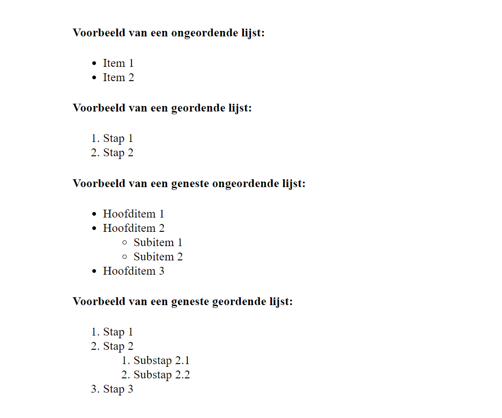

# AltunIT | HTML-Lijsten

## Inleiding
In dit project behandelen we verschillende soorten HTML-lijsten. Hieronder vind je enkele voorbeelden van ongeordende lijsten (unordered lists), geordende lijsten (ordered lists) en geneste lijsten (nested lists). Deze worden vaak gebruikt om gestructureerde informatie overzichtelijk weer te geven, zoals opsommingen of stappenplannen.

## Eindresultaat

# Voorbeelden van HTML-lijsten
1. Ongeordende lijst - Unordered List 
   - Een ongeordende lijst wordt gebruikt om items zonder specifieke volgorde weer te geven. De items worden standaard weergegeven met opsommingstekens (bullets).
2. Geordende lijst - Ordered List 
   - Geordende lijsten worden gebruikt wanneer de volgorde van de items belangrijk is, zoals bij stappenplannen of instructies. In plaats van opsommingstekens worden de items genummerd.
3. Geneste lijsten Nested Lists
   - Lijsten kunnen genest worden binnen andere lijsten. Dit betekent dat een lijst zich binnen een ander lijstitem bevindt. Geneste lijsten zijn nuttig voor het weergeven van subcategorieën of meerlagige stappenplannen. Zowel ongeordende als geordende lijsten kunnen worden genest.   
